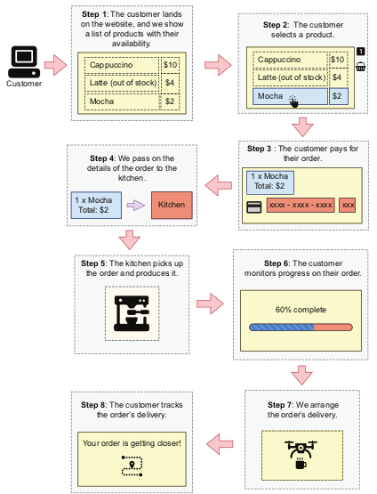

# 🚀 Full-Stack Deployment: CoffeeMesh

<div style="text-align:center;"> 

</div>

## 🎯 Project Overview

The main goals are to:

- Serve using **FastAPI** backend  
- Create an interactive **React** frontend
- Package the backend and frontend as **Docker containers** for portability  
- Deploy and scale the application with **Kubernetes** for real-world production readiness  

## 🚀 Features at a Glance
 
- 🔥 **FastAPI Backend:** Lightweight, fast, and asynchronous API server  
- ⚛️ **React Frontend:** Modern, responsive interface for user inputs and prediction display  
- 🐳 **Dockerized:** Container images for easy packaging and distribution  
- ☸️ **Kubernetes Deployment:** Scalable, resilient deployment configuration  

## 📁 Project Structure

```
tabular-ml-deployment/
├── backend/
│   ├── main.py                     # FastAPI app serving the model API
│   ├── model\_utils.py              # Model loading and preprocessing helpers
│   ├── requirements.txt            # Backend Python dependencies
│   └── Dockerfile                  # Docker container setup for backend
│
├── frontend/
│   ├── public/
│   ├── src/
│   │   ├── components/
│   │   │   ├── InputForm.js        # Form component for feature input
│   │   │   └── ResultDisplay.js    # Displays prediction results
│   │   ├── App.js                  # Main React app component
│   │   └── index.js                # React entry point
│   ├── package.json                # Frontend dependencies and scripts
│   └── Dockerfile                  # Docker container setup for frontend
│
├── k8s/
│   ├── backend-deployment.yaml    # Kubernetes deployment manifest for backend
│   ├── backend-service.yaml       # Service exposing backend API
│   ├── frontend-deployment.yaml   # Kubernetes deployment manifest for frontend
│   ├── frontend-service.yaml      # Service exposing frontend app
│   └── ingress.yaml               # Optional ingress routing config
│
├── .gitignore
└── README.md

```

## 🛠️ Getting Started

### Backend Setup

1. Go to the `backend/` directory  
2. Install dependencies:
   ```bash
      pip install -r requirements.txt
   ```
3. Run the FastAPI server locally:
   ```bash
   uvicorn main:app --reload
   ```
4. Test the API endpoint:
   * `POST /predict` — Send JSON with tabular features, receive predictions


### Frontend Setup

1. Navigate to the `frontend/` directory
2. Install npm packages:
   ```bash
   npm install
   ```
3. Start the React development server:
   ```bash
   npm start
   ```
4. Use the web interface to enter data and get model predictions

### Docker & Kubernetes Deployment

1. Build Docker images for backend and frontend:

   ```bash
   docker build -t yourusername/backend:latest ./backend
   docker build -t yourusername/frontend:latest ./frontend
   ```

2. Push images to your container registry (Docker Hub, AWS ECR, etc.)

3. Apply Kubernetes manifests to deploy the app:

   ```bash
   kubectl apply -f k8s/
   ```

4. Access your app through the configured Kubernetes ingress or service URL

## 📈 Future Improvements

* Add validation and error feedback for user inputs
* Implement batch predictions for large datasets
* Add user authentication and logging
* Integrate monitoring with Prometheus and Grafana
* Create CI/CD pipelines for automated deployment

## 📄 License

MIT License © 2025 Your Name
